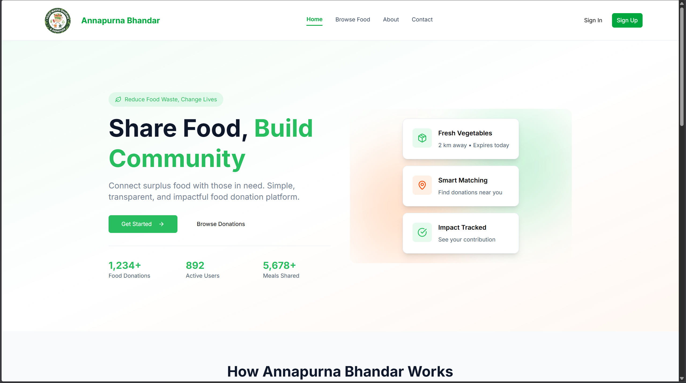
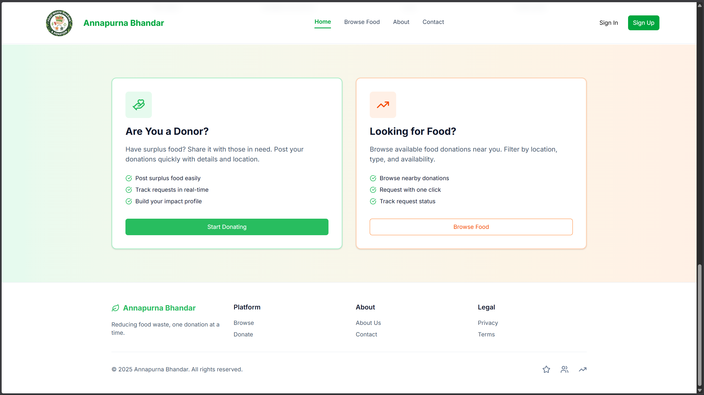

# 🍲 Food Waste Sharing and Donation Platform – Frontend

A modern, responsive web application designed to **connect surplus food donors with recipients in need**, helping reduce food waste and fight hunger through technology.

This project is developed as a **Final Year Project (FYP)** with a strong focus on usability, scalability, and social impact.

---

## 🌍 Project Vision

Every day, large amounts of edible food are wasted while many people struggle to get proper meals.  
**Food Waste Sharing and Donation Platform (Annapurna Bhandar)** bridges this gap by enabling:

- Restaurants, households, and organizations to donate surplus food
- NGOs and individuals to browse and request available food
- Administrators to monitor, verify, and manage the platform

Together, we aim to build a **sustainable, community-driven food sharing ecosystem**.



---

## ✨ Key Features

### 👥 User Roles
- **Donor** – Post and manage surplus food items
- **Recipient** – Browse, request, and claim food
- **Admin** – Verify users, manage documents, and oversee platform activity

### 🍱 Core Functionalities
- Surplus food listing with quantity & location
- Browse and claim available food items
- Secure authentication (Login, Register, OTP verification)
- Forgot password & email verification flow
- Real-time notifications for food requests
- Admin dashboard for user and document verification

### 🎨 UI & UX
- Fully responsive design
- Clean and modern interface
- Built using **Tailwind CSS** and **shadcn/ui**
- Reusable, accessible UI components

---

## 🛠️ Tech Stack

### Frontend
- **React.js** – Component-based UI development
- **Vite** – Fast build tool and dev server
- **Tailwind CSS** – Utility-first styling
- **shadcn/ui** – Accessible, reusable UI components

### Architecture & Tools
- **React Context API** – Global state management
- **React Router** – Routing & protected routes
- **Custom Hooks** – Authentication & user data handling
- **API Services** – Backend communication layer

---

## 📂 Project Structure

```text
├── src
│   ├── assets                  # Images (logo, banners, illustrations)
│   ├── components              # Reusable UI components
│   │   └── ui                  # shadcn/ui components (button, card, input, tabs)
│   ├── context                 # Global app context (auth, user)
│   ├── hooks                   # Custom hooks (useLogout, useMe)
│   ├── pages
│   │   ├── admin               # Admin dashboard & verification pages
│   │   ├── auth                # Login, Register, OTP, Password reset
│   │   ├── donor               # Donor dashboard & food creation
│   │   ├── landing             # Home, About, Browse, Contact pages
│   │   └── recipient           # Recipient dashboard & food browser
│   ├── routes                  # AppRoutes & ProtectedRoute
│   ├── services                # API services (auth, profile, food)
│   └── styles                  # Global styles
├── public                      # Static assets
└── vite.config.js              # Vite configuration
```

---

## 🚀 Getting Started

### Prerequisites
- **Node.js** (v18 or higher recommended)
- **npm** or **yarn**

### Installation

```bash
git clone https://github.com/AdkNiruta1/Food-Waste-Sharing-and-Donation-Platform-Frontend.git
cd Food-Waste-Sharing-and-Donation-Platform-Frontend
npm install
```

### Run Locally

```bash
npm run dev
```

Open your browser and navigate to:
```
http://localhost:5173
```

---

## 🤝 Contributing

Contributions are welcome!  
You can:
- Open issues for bugs or feature suggestions
- Submit pull requests to improve functionality or UI

---

## 📄 License

This project is **open source** and available for learning and academic use.  
You are free to use, modify, and extend it.

---

## 💚 Social Impact

By promoting food donation and reuse, this platform:
- Reduces food wastage
- Supports vulnerable communities
- Encourages social responsibility

**Together, let's reduce food waste and feed those in need.** 🍽️💚
